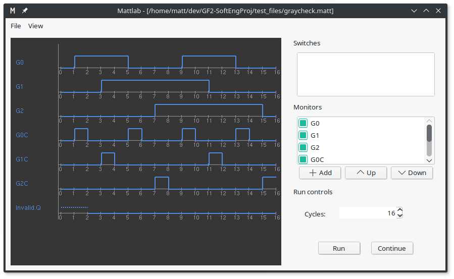
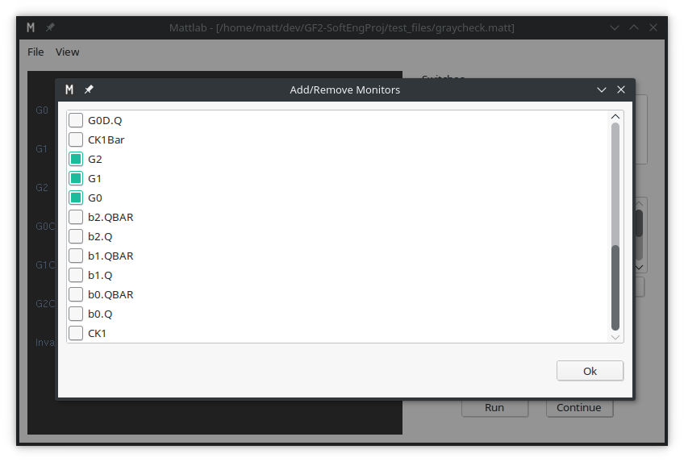

# Mattlab Logic Simulator



## Summary

Mattlab is a Logic Simulator developed in C++ by Matt Judge, Matt Diesel and Matt March as a submission for the [GF2 Software](http://teaching.eng.cam.ac.uk/content/engineering-tripos-part-iia-project-gf2-software-2017-18) module at Cambridge (3rd year Engineering Tripos).

The project comprised:
* The [definition](./docs/MattlangSpec.pdf) of a custom language ("[mattlang](#mattlang)") capable of describing and representing logical circuits with multiple devices and connections
* The creation of a scanner and parser to process mattlang files and build an internal representation of the circuit described
* The modification of simulation code (determining the output of each device given current inputs) to support additional devices to those already implemented
* A command line tool to interact with the simulator and display a text-based representation of the outputs
* The design and creation of a graphical user interface to interact with, and graphically display the results of, the simulator
  

Throughout the development process, unit and integration testing was crucial to ensure a reliable and stable end product was achieved.

## Mattlang

Mattlang is a descriptive language designed to be capable of representing digital logic circuits in an easily-readable but versatile format. With use of the `import` statement, projects could comprise multiple Mattlang files, allowing the extensibility that large circuits require.

For a full description of the language, including its [EBNF grammar](https://en.wikipedia.org/wiki/Extended_Backus%E2%80%93Naur_form), see the [language specification](./docs/MattlangSpec.pdf) (well worth a glance!). It is worth noting that the language is case-insensitive.

### Keywords

The following set of identifiers are keywords for the language, and cannot be used as device names, monitor aliases or device types: `dev`, `monitor`, `as`, `import`


### Devices
The primary component of Mattlang, the device, represents a logical gate. When fully defined, a device specifies the logical gate it represents, all required inputs and properties (such as clock period, signal generator bit stream, etc).
```
dev G1 = AND {    // define a device called G1, of the type AND
	I1 : CK1;     // input 1 is connected to the output of the device called CK1
	I2 : SW1;     // input 2 is connected to the output of the device called SW1
}                 // close the definition of G1
```
Supported device types include:
* `CLOCK`; property: `Period`
* `SWITCH`; property: `InitialValue`
* Standard gates (`AND`, `NAND`, `OR`, `NOR`); up to 16 inputs: (`I#`)
* `XOR`; exactly 2 inputs (`I1`, `I2`)
* `DTYPE` latch; inputs: `DATA`, `CLK`, `SET`, `CLEAR`; outputs: `Q`, `QBAR`
* `SIGGEN` signal generator; properties `SIG` defining the bit stream to generate on repeat and `Period` defining the number of simulation cycles each signal element is held for

### Monitors
Monitors allow signals within the circuit to be measured and traced. They can also be shown to the user under an alias signal name, allowing signals in the network to be re-interpreted to user-friendly names if they have other meanings.
```
monitor G1 as Result;    // show the output of G1, but call it Result
```

## Scanner and Parser

The scanner was responsible for translating the sequence of characters in the input mattlang file into a sequence of tokens for processing by the parser. The parser was responsible for taking this stream of tokens, and manipulating the network builder (to build the internal representation of the input circuit). Due to the design of the language, this process could be implemented with use of a single lookahead ([LL(1)](https://en.wikipedia.org/wiki/LL_parser)) parser, simplifying the process.

### Error Handling
An early decision was made to ensure the handling of errors was done in as user-friendly a manner as possible. Comprehensive error messages achieve this aim, even going so far as to suggest auto-corrections to mistyped device types or `DTYPE` input pins.

As an example, if a device is defined with a typo in the device type, the following error message is shown, displaying the position in the file at which the error was encountered and the offending line:
```
[matt@matt-pc-linux GF2-SoftEngProj]$ ./clisim ./test_files/misnamed.matt 
misnamed.matt (3:12): SyntaxError: Expected a device type. Did you mean
                      OR or XOR?
dev sig1 = LOR {
           ^ ERROR

File parsed with 1 errors and 0 warnings.
```

## CLI

The command line interface was created to enable interaction with the simulation logic, including running the simulation, enabling monitors, and setting switch values. The simulation traces are displayed in a textual form alongside monitor names. Example output is shown below.
```
[matt@matt-pc-linux GF2-SoftEngProj]$ ./clisim ./test_files/graycheck.matt 
File parsed with 0 errors and 0 warnings.
Logic Simulator: interactive command interface
# help

User commands -

r N       - run the simulation for N cycles
c N       - continue simulation for N cycles
s X N     - set switch X to N (0 or 1)
m X       - set a monitor on signal X
z X       - zap the monitor on signal X
d N       - set debugging on (N=1) or off (N=0)
h         - help (this command)
q         - quit the program

# r 16
Running for 16 cycles
G0                 :_----____----___
G1                 :___--------_____
G2                 :_______--------_
G0C                :_-___-___-___-__
G1C                :___-_______-____
G2C                :_______-_______-
Invalid.Q          :~~______________
# 
```

## GUI
The graphical user interface was designed to present all options available in the command line interface, in an intuitive and straightforward way. The majority of the screen is occupied with the monitor traces on a scalable and scrollable canvas, with options to configure switches and select / reorder monitors in a panel on the right. A further menu option allows the selection of the preferred colour scheme.

The monitor dialogue shows a comprehensive list of device outputs available to monitor.



## Testing
### Unit Testing
A heavy emphasis was initially put on unit testing, utilising the [Google Test framework](https://github.com/google/googletest) to maximise efficiency. Frameworks were developed to enable unit testing for both the scanner and parser, with interfaces between the classes being tested and other classes emulated as much as possible to ensure testing was following the unit test methodology. 
The scanner unit tests accepted a string input (imitating a user definition file), and the output was tested against a stream of expected tokens. The parser unit tests required emulation of both the scanner and network builder, passing if (given a stream of test input tokens) the manipulations of the parser on the network builder were as expected.

### Integration Testing
Integration testing of the whole system, or combined sections of it, was carried out by creating test definition files that were suspected to include components that the system would have trouble processing, or were inherently complex, and inspecting the output / errors detected.

